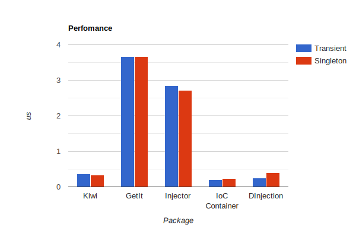

# DI Container 🗄️


DI Container is a lightweight DI library inspired by .NET `Service Collection` and `Service Provider`.

## Features

- [X] Global services scope
- [X] Singleton & Transient lifetimes
- [X] Register base types
- [X] Get all types of base
- [X] High Performance

## Examples

Basic usage: 
```dart
//
final services = ServicesCollection() //
    .add((_) => ServiceA())
    .build();

//
final service = services.getOf<ServiceA>();

//
service.foo();
```

Global services: 
```dart
//
final services = ServicesCollection() //
    .add((_) => ServiceA())
    .build()
    .setGlobal();

//
functionWithNoParameters();

//
void functionWithNoParameters() {
  final service = gServices.getOf<ServiceA>();
  service.foo();
}

```

Base type : 

```dart
//
final services = ServicesCollection() //
    .base<BaseServiceA>((base) => base.add((services) => ServiceA()))
    .build();

//
final service = services.getOf<BaseServiceA>();

//
service.foo();
```

Get all types of base : 

```dart
//
final services = ServicesCollection() //
      .base<BaseServiceA>((base) => base //
          .add((services) => ServiceA())
          .add((services) => ServiceB()))
      .build();

//
final base = services.getManyOf<BaseServiceA>();

//
for (var b in base) {
  b.foo();
}
```

## Perfomance

Here is a perfomance chart of other libraries performing get for transient and singelton.


